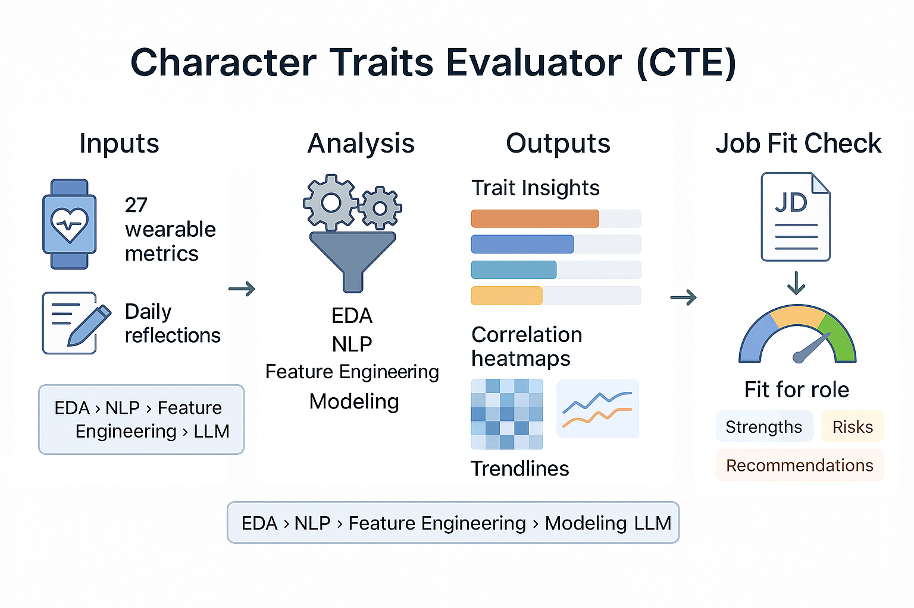

# Character Traits Evaluator (CTE)



A project that analyzes 27 wearable metrics and daily reflections, runs EDA/NLP/ML, and uses an LLM to profile traits and generate data-driven recommendations.


Broadly, it is a machine-learning pipeline that turns mixed personal-tracking data (sleep, mood, productivity, habits, daily reflections) into clean, model-ready features and interpretable behavioral insights.

The system analyzes behavioral patterns to estimate personality traits and evaluates personality, job compatibility against specific role requirements. All processing runs locally for privacy; raw personal data is excluded from version control.

## Overview

I wanted to know how sleep, routines, and social context actually show up in my day-to-day work productivity and performance. So I tracked 27 different parameters - sleep, mood, productivity, habits, and daily reflections - for 72 days.

**CTE** takes those raw logs (timestamps, durations, booleans, text), cleans them with deterministic rules (fixed formats, no guessing), and produces a tidy, typed Parquet table that’s ready for feature engineering and modeling.

> **Status:** Phase 3 (feature engineering and baseline modeling complete, moving toward advanced modeling) ✅


## Current Features

- **Robust Data Cleaning**
  - Header normalization and schema standardization
  - Deterministic date parsing with default-year fallback
  - Time parsing to **minutes-after-midnight** features (`*_time_minutes`)
  - Duration parsing (e.g., `7h38m`, `7:38`) to decimal hours
  - Flexible boolean coercion (`yes/no/y/n/true/false/t/f/1/0`)
  - Social interaction encoding with **no-interaction flags**
  - Percentage/number coercion with validation and clipping
  - “When most productive” codebook decoding + one-hot indicators

- **Privacy-First**
  - All processing runs locally
  - No external API calls or cloud dependencies
  - Raw personal data excluded from version control

- **Production-Ready Engineering**
  - Type-safe transformations with explicit parsing rules
  - CLI interface with argument parsing
  - Reproducible environment via Poetry + Python 3.11

## Recent Progress

With **03_Baselines.ipynb**, the project now includes a predictive layer that connects behavioral features to daily productivity.

- Implemented time-aware baseline models (Linear, Ridge, Random Forest, Gradient Boosting)
- Added regression metrics (MAE, RMSE, R², MAPE)
- Introduced expanding-window cross-validation for temporal consistency
- Generated visual diagnostics (predicted vs true plots, residuals, feature importances)
- Built model card and leaderboard export for reproducibility

## Upcoming Work

- Add lag and rolling features for temporal context
- Introduce XGBoost/LightGBM with hyperparameter tuning
- Compare against baseline leaderboard
- Explore SHAP for interpretability

## Quick Start

### Requirements
- Python **3.11+**
- [Poetry](https://python-poetry.org/) for dependency management

### Install and run (demo with sample data)

```bash
git clone https://github.com/deepakdeo/cte-project.git
cd cte-project
poetry install
```

Run the cleaning pipeline on the included sample:

```bash
poetry run python src/cte/data.py   --in data/sample/cte_sample.csv   --out data/sample/clean_sample.parquet
```

Inspect the processed output:

```bash
poetry run python -c "
import pandas as pd
df = pd.read_parquet('data/sample/clean_sample.parquet')
print(f'Dataset: {df.shape[0]} rows, {df.shape[1]} columns')
print('\nSample columns:', df.columns[:12].tolist())
print('\nHead:\n', df.head(3))
"
```

## Supported Data Types (Cleaned Schema)

**Sleep & Timing**
- `sleep_duration_h` (float hours)
- `wakeup_time_minutes`, `bed_time_minutes`, `dinner_time_minutes` (int minutes after midnight)

**Productivity**
- `productivity_pct` (0–100; validated/clipped)
- `when_most_productive_decoded` (categorical)
- `prod_morning`, `prod_afternoon`, `prod_evening`, `prod_none` (one-hot ints)

**Health & Habits**
- `studied_at_home`, `studied_at_school`, `workout_did`, `meditation`,
  `morning_shower`, `played_sports`, `sickness`, `nap_today` (Int64 0/1)
- `water_drank_l`, `breakfast_quality`, `lunch_quality`, `dinner_quality` (floats)

**Social Interactions**
- `{partner|family|friends}_score` (−1=negative, 0=neutral, +1=positive, NaN=unknown)
- `{partner|family|friends}_no_interaction` (Int64 0/1)

**Mood & Text**
- `primary_mood`, `secondary_mood` (normalized strings)
- `reflection` (free text; unmodified)

> The original CSV headers (with newlines/typos) are normalized internally; see `src/cte/data.py::RENAME_MAP`.

## Project Layout

```
cte-project/
├── data/
│ ├── sample/
│ │ └── cte_sample.csv         # small demo dataset (committed)
│ ├── raw/                     # your private raw data (gitignored)
│ └── interim/                 # cleaned / feature data (gitignored)
├── notebooks/
│ ├── 01_Preprocessing.ipynb   # data cleaning
│ ├── 02_Features.ipynb        # feature engineering
│ ├── 03_Baselines.ipynb       # baseline modeling
│ └── reports/
│ ├── figures/                 # generated visual outputs
│ └── baseline_leaderboard.csv # model leaderboard
├── models/                    # saved trained models (.joblib)
├── src/
│ └── cte/
│ ├── init.py
│ ├── data.py # cleaning pipeline (MVP)
│ ├── features.py # feature engineering logic
│ └── models.py # modeling utilities (future)
├── .gitignore
├── poetry.lock
├── pyproject.toml
└── README.md
```
> The `Project Layout` above shows the repository structure as of **Phase 3**.  
> Within `src/cte/`, upcoming modules like `api.py` (for deployment) and `insights.py` (for interpretability) will be added as phases progress.


## Development Roadmap

**Phase 1 — Data Foundation** ✅  
- Cleaning pipeline, schema normalization, documented sample

**Phase 2 — Feature Engineering** ✅  
- Rolling windows, trend/volatility, circadian features

**Phase 3 — Baseline Modeling** ✅  
- Linear, Ridge, RandomForest, GradientBoosting regressors
- Time-aware cross-validation and baseline leaderboard

**Phase 4 — Interpretability**  
- SHAP/LIME, feature importances, ablations

**Phase 5 — Advanced Analytics**  
- NLP on reflections, structured insight generation

**Phase 6 — Deployment**  
- FastAPI endpoints, Streamlit demo, Dockerization

## Tech Stack

- **Core**: Python 3.11, pandas, numpy
- **Tooling**: Poetry, argparse CLI
- **Planned ML**: scikit-learn, XGBoost/LightGBM
- **Planned NLP**: HuggingFace Transformers
- **Planned Deployment**: FastAPI, Streamlit, Docker

## Privacy

CTE is designed for local analysis of personal data. All processing occurs on your machine; raw personal data is excluded from version control by default.

## License

MIT — see [LICENSE](LICENSE).
